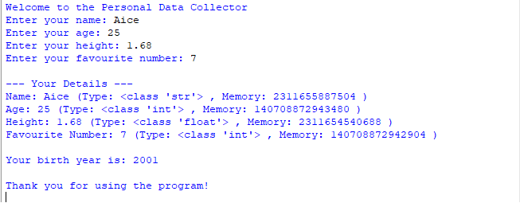

# Personal Data Collector (Python)

## 📌 Project Description
This is a beginner-level Python program created as part of the **Fundamental Booster** assignment.

The program:
- Takes personal information from the user
- Displays the entered data
- Shows the data type and memory address of each value
- Calculates the user’s birth year

This project uses only basic Python concepts like `print()`, `input()`, variables, type casting, `type()`, and `id()`.

---

## 🧠 Concepts Used
- print()
- input()
- Variables
- Data Types (string, integer, float)
- Type Casting (`int()`, `float()`)
- Arithmetic Operators
- `type()` function
- `id()` function

---

## ▶️ How to Run the Program
1. Make sure Python is installed on your system
2. Download or clone this repository
3. Open a terminal or command prompt
4. Run the file using:

python main.py

🖥️ Sample Output
You can view the sample program output below:

ℹ️ The memory addresses shown will change every time the program runs. This is normal.
